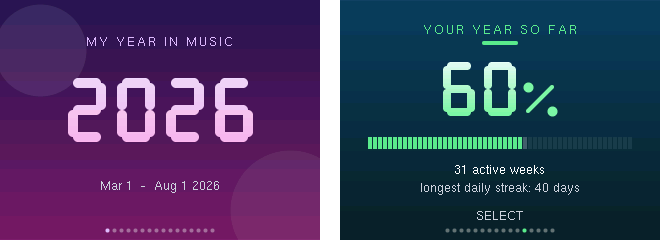
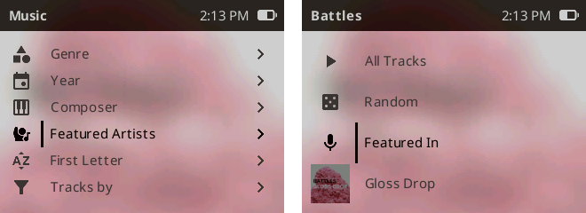
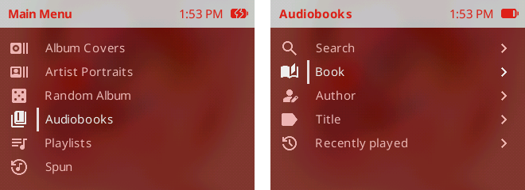

# PodBox

PodBox is a modified version of Rockbox for the iPod Classic and iPod Video with a focus on simplifying
Rockbox whilst providing album and artist art everywhere with colour schemes that
follow the music.

# Key features

## Colours that follow the music


The interface re-colours itself from the current album art, throughout the user
interface.  PodBox ships with [Scrim](themes/scrim/README.md) - a new theme built around the enhanced theme
features including art filters, alpha blend boxes and spectrum visualization. There
are two variants with different playing screens.

## Art everywhere


Album covers sit beside the rows in the album browser, and artist photos beside
artist rows. Two carousels are available from the main menu — **Album Covers**
and **Artist Portraits** — and you can go straight from a cover into that album,
or from an artist into their albums.


## Instant search


You can now search across tracks, albums and artists with instant results.  Additionally,
the grid keyboard is gone, replaced by a single-line editor driven entirely by the click
wheel.  Search is also available in settings to make finding things easier.

## Themed throughout


Dialogs, splashes and prompts have been standardised and improved, and screens that used to
break out of the theme no longer do.

## Your music library


The database menu is now called Music and its views can be promoted onto the main menu. You
can also turn items on and off inside the Music menu, order albums by year, and see
album and artist chart information (frequently played, recently played, forgotten). You can
even break Audiobooks out into their own root menu (see below).

## Documents, pictures and lyrics too


While the plugins have gone, the image viewer has been ported to the core system and
there's an improved text viewer that handles more file formats (including txt, lrc,
fb2, epub, docx, pdf, md, html and rtf).  There's also a new lyric viewer that can
be accessed from the "what's playing" screen by pressing `select+play`.

## Spike

https://github.com/user-attachments/assets/05af8d6b-33a6-4882-a8aa-bca1fbabdb54

Play Spike while listening to your music. The game analyses each track's rhythm 
and generates unique levels that move with the beat. Challenge yourself to play 
through an entire album or tackle tracks individually to set new high scores.

Launch Spike from the context menu (hold <code>Select</code>) on the Now Playing 
screen, or while a track is highlighted in the music browser.

## Spun embedded



A modified version of Spun is embedded which reads your playback log (whether it's the
default logging or last.fm logging) and presents a summary of your year in music.  Hold
Menu to save the cards to your iPod.  See [here](https://github.com/majorsiebe/Stats_for_iPod) for more information.

---

# Installation

## Does it run on my iPod?

| iPod | Generation | Years |
|---|---|---|
| **iPod Classic** | 6th / 7th gen | 2007–2014 |
| **iPod Video** | 5th / 5.5th gen | 2005–2006 |

Nothing else — not the Nano, Mini, Shuffle or Touch. If you have one of those,
you want [Rockbox](https://www.rockbox.org) itself, which supports 80+ players.

## Installing PodBox

Grab the zip for your player [here](https://github.com/anthonyfletcher/podbox/releases) — `rockbox-ipod6g.zip` for the Classic,
`rockbox-ipodvideo-5g.zip` for the Video — and unzip it into the root of the
iPod's disk, so that the `.rockbox` folder sits alongside your music. That is
the whole update.

> **First time on this iPod?** A fresh player also needs the Rockbox bootloader
> installed once, which is a separate step and is not covered here — follow the
> [Rockbox installation guide](https://www.rockbox.org/manual.shtml) for your
> model first. If you are already running Rockbox or RockPod, unzipping is all
> you need.

# Setting up your music library

For best results, your music library should be set up in the following structure:

```text
Artist One
├── Album One
│   ├── 01 Track.flac
│   ├── 01 Track.lrc
│   ├── 02 Track.flac
│   ├── ...
│   └── folder.jpg
├── Album Two
│   └── ...
└── folder.jpg
Artist Two
└── Album One
    └── ...
Artist Three
└── Album One
    └── ...
```

## Album and artist art

To support the carousel and artwork in lists, your album art should be stored with the album
tracks as either folder.jpg or cover.jpg e.g. `Artist/Album/folder.jpg`.

Without these files, the art cache will only build from embedded images as tracks are played.

Your artist art should be stored with the album folders as either folder.jpg or cover.jpg
e.g. `Artist/folder.jpg`.

All artwork should be:

- stored as a baseline / non-progressive JPEG file
- stored at a "reasonable" resolution (the cache only stores them as 300x300px images) - anything
bigger than this will just take longer to process.

Artwork is processed quietly in the background while the database is idle, so browsing stays
fast.  As such, it can take a while to see the art appear.  You can check the cache activity by
checking `System > Background Tasks`.

A tool is available [here](tools/art_fetch/README.md) to fill your library with album and artist
artwork.

## Lyrics

To be able to access lyrics your lyrics should be:

- embedded in your audio files or stored with the album tracks with the same name as the track but
with a different extension e.g. `Artist/Album/01 Track.lrc`
- stored as either a .lrc, .lrc8 or .snc file

# Installing themes

PodBox will support all Rockbox themes, however without modification they will **not** support dynamic
colours or art in lists.

To get the most out of PodBox you should use Scrim, the theme PodBox ships with.

Additional [themes](themes/README.md) designed for PodBox are a separate download, one zip each, from 
the [Themes release](https://github.com/anthonyfletcher/podbox/releases/tag/Themes):

- [themify 2](themes/themify_2/README.md)
- [obsede 2](themes/obsede_2/README.md)
- [bony](themes/bony/README.md)

All PodBox themes attempt to support as many languages as possible.

Unzip onto the root of the iPod, the same way you installed PodBox, then pick
it under `Settings > Appearance > Load Theme`. Each zip carries the fonts its theme needs, so
they can be installed in any order and on their own.

---

# Complete feature list

## Root menu

- Control the items displayed on the root menu and their order, promote items from the Music menu to the root menu.
  - `Settings > Appearance > Edit Main Menu`

## Music

- Album art displayed next to album rows
  - Theme dependent
  - See above for artwork setup
  - Control visibility via `Settings > Appearance > Elements > Album Art Rows`
- Artist profile displayed next to artist rows
  - Theme dependent
  - See above for artwork setup
  - Control visibility via `Settings > Appearance > Elements > Artist Art Rows`
- Control the sort order of the albums list
  - `Settings > Library > Music > Sort Albums By`
- Start playing a random album
  - `Music > Random Album`
- Search with live results across track, album or artist names
  - `Music > Search`
  - Control ordering of results via `Settings > Library > Music > Search`
  - See [`text-input-guide.md`](docs/podbox/text-input-guide.md) for guidance on inputting text
- See the most played albums/artists
  - `Music > Playback History`
- See the most recently played albums/artists
  - `Music > Playback History`
- See your forgotten album/artists
  - `Music > Playback History`
- Control the items displayed in the Music menu and their order
  - Change via `Settings > Library > Music > Edit Music Menu`
- Trim noise from track and album names (like featuring information)
  - Off by default.  Turn the feature on by going to `Settings > Library > Music > Trim Titles`

## Featured Artists



- See featured artists and their associated tracks - plus from an artist
  see the tracks they feature in
  - Off by default.  Turn the feature on by going to `Settings > Library > Music > Featured Artists`
  - `Music > Featured Artists` to access
  - See [`featured-artists-guide.md`](docs/podbox/featured-artists-guide.md) for more information

## Audiobooks



- Audiobooks can be segregated from Music into their own root menu and are excluded
from the Music menu and carousels
  - Off by default.  Turn the feature on by going to `Settings > Library > Music > Segregate Audiobooks`
  - Audiobooks should have a genre of "audiobook", "spoken word", "book", or "podcast".
- Audiobooks automatically receive a "resume" function - you don't need to bookmark
your position.

## Album Covers/Artist Profiles

- Simplified implementation which links to Music for tracks/albums
- Significantly improved performance (particularly on iPod 5)
- Control whether opening an album lists the album tracks or starts playing the album
  - `Settings > Library > Carousel > On Album Select`
- Display the covers/profiles in a flat top-down mode
  - `Settings > Library > Carousel > View Mode`

## What's playing

- View lyrics for currently playing music
  - Press `Select + Play` (the hotkey's default; reassign it under `Settings > Playback > Now Playing Screen`)
- Control how lyrics are displayed
  - `Settings > Library > Viewers > Lyrics Viewer`
- Show either album art or artist art in the now playing screen
  - Theme dependent (must currently show album art)
  - In auto mode the art will be shown depending on how you arrived at playing the track. If
you opened `Music > Artist > Album > Track` the artist art would show - if you opened `Music >
 Album > Track` the album art would show.

## Files/Documents/Images

- Re-engineered text engine compatible with more formats
- Control how documents are displayed (font, margin, line spacing, colours)
  - `Settings > Library > Viewers > Text Viewer`
- See a list of all documents and images stored on the device
  - Hidden by default - enable via `Settings > Appearance > Edit Main Menu`
- Continue reading added to the root menu to continue from where you left off
- Search across all files

## Appearance

- Dynamic colouring of the UI based on the album/artist art including transformation of all theme colours.
  - Theme dependent
  - `Settings > Appearance > Colours > Dynamic Colours`
- Edits to appearance settings save to a config file linked to the running theme, so when you revert themes your settings follow, and themes don't inherit settings they don't set
  - `Settings > Appearance`
  - To reset to default
  - `Settings > Appearance > Forget My Changes`
- Art filters available to modify art in the carousel
  - `Settings > Library > Carousel > Artwork Filter`

## Language

- Override language strings with your own to customise your experience
  - See [`language-override-guide.md`](docs/podbox/language-override-guide.md)

## Settings

- Settings reworked
  - See [`settings-guide.md`](docs/podbox/settings-guide.md)
- Search settings by keyword
  - Settings > Search (scroll up)
  - See [`text-input-guide.md`](docs/podbox/text-input-guide.md) for guidance on inputting text
- Settings organised into "Standard" and "Everything" to filter out settings not commonly edited
  - `Settings > Settings Mode`
- See all changed settings in a single view
  - `Settings > Changed Settings`
- View a description of each setting from the setting menu
  - Hold `Select` to open the context menu then select `Explain`

## Behind the scenes

- Inline earphone remote support (iPod classic 120GB - Late 2008 and
  iPod classic 160GB - Late 2009 thin version only)
  - Click for play/pause, two clicks for the next track, three for the previous one, and the volume buttons
  - `Settings > System > Accessories > Remote Track Skip` turns the multi-click feature off, which makes play/pause react quicker
- Improved consistency of the `Back` and `Menu` button in menus
- Art for use in the UI is cached for quick access to enable a fluid experience
  - `Settings > Library > Art Cache` for settings
  - `Settings > Library > Maintenance > Update Art Cache`/`Rebuild Art Cache` for tasks
  - `System > Background Tasks` for monitoring
- Information about albums, artists and play counts now centralised in a database summary index
  - `Settings > Library > Maintenance > Update Index`/`Rebuild Index` for tasks
  - `System > Background Tasks` for monitoring
- Dialogs reworked to provide consistent and "themed" message, input, confirmation, search, colour, date/time and folder select boxes
  - `Settings > Appearance > Colours` for settings
- Additional theme tags to provide richer graphics and support easier theme development
  - See [`custom-skin-tags.md`](docs/podbox/custom-skin-tags.md)

---

# Technical details

See [`technically-curious.md`](docs/podbox/technically-curious.md) for the history of PodBox and how to build
your own version.

Theme builders: See [`theme-guide.md`](docs/podbox/theme-guide.md) for guidance on creating
themes for PodBox.

## Licence

RockBox, RockPod and additions by PodBox are licensed under the [GNU General Public License v2.0](https://www.gnu.org/licenses/old-licenses/gpl-2.0.html).

Imported code governed by a previous licence is listed in
[`docs/LICENSES`](docs/LICENSES); the fonts and themes this fork adds are
credited below, each with a link to its full licence text.

## Development credits

This project has been developed with extensive AI assistance. I am a software developer, 
although C is not my primary language. I have driven the project's architecture, feature 
design, specifications, implementation approach, testing, debugging, and iteration. AI 
has been used as a development tool to assist with the C implementation, generate and 
explore solutions, and accelerate development. The resulting code is reviewed, tested, 
and iterated by me rather than being accepted as unreviewed generated output.

This is a hobby project, built because I wanted a version of Rockbox that better suited 
how I use my iPod. I'm sharing it in the hope that others might find it useful too.

Built on the work of:
- the [Rockbox](https://www.rockbox.org/) project
- the [RockPod](https://github.com/nuxcodes/rockpod) project (Nux Li: aka [@nuxcodes](https://github.com/nuxcodes))
- the [Spun](https://github.com/majorsiebe/Stats_for_iPod) project (Siebe Majoor: aka [@majorsiebe](https://github.com/majorsiebe))

## Other credits

### Themes

- Themify 2
  - Created by: Evan Kenny aka [Dook](https://d00k.net/)
  - License: CC BY-SA 3.0 (https://creativecommons.org/licenses/by-sa/3.0/deed.en)
- Obsede' 2
  - Created by: Serge Fahnenstell
  - License: CC BY-SA 3.0 (https://creativecommons.org/licenses/by-sa/3.0/deed.en)
- Bony
  - Based on BONES created by: Chuck Lardo
  - License: CC BY-SA 4.0 (https://creativecommons.org/licenses/by-sa/4.0/deed.en)

### Fonts

Each theme carries the full licence text of the fonts it ships, beside them in
its own `.rockbox/fonts/`. The links below point at one copy of each.

- Material Design Icons
  - Created by Google (https://fonts.google.com/icons)
  - Licensed under the Apache License Version 2.0 —
    [full text](themes/scrim/.rockbox/fonts/LICENSE-Material-Design-Icons.txt)
- Noto Sans/Serif Font
  - Copyright 2022 The Noto Project Authors (https://github.com/notofonts/latin-greek-cyrillic)
  - Noto Sans built from MicroNotoSans - a fork of Noto Sans by Evan Kenny aka [Dook](https://d00k.net/)
  - Copyright 2026 Micro Noto Sans Authors (https://github.com/D0-0K/MicroNotoSans)
  - Licensed under the SIL Open Font License, Version 1.1 —
    [full text](themes/scrim/.rockbox/fonts/LICENSE-Noto.txt)
- Seven Fifteen Font
  - Copyright Douglas Vautour (https://burpyfresh.itch.io/seven-fifteen-font)
  - Bundled together with UnifontEX, a fork of GNU Unifont maintained by stgiga
    (https://github.com/stgiga/UnifontEX), which draws the scripts Seven Fifteen
    does not cover
  - Seven Fifteen licensed under CC BY-SA 4.0; UnifontEX under the GNU General
    Public License version 2 or later with the GNU font embedding exception, or
    the SIL Open Font License version 1.1 —
    [full text](themes/scrim/.rockbox/fonts/LICENSE-Seven-Fifteen.txt)
- League Spartan Font
  - Copyright 2020 The League Spartan Project Authors (https://github.com/theleagueof/league-spartan)
  - Copyright 2022 The Noto Project Authors (https://github.com/notofonts/devanagari)
  - Copyright 2026 Micro Noto Sans Authors (https://github.com/D0-0K/MicroNotoSans)
  - Licensed under the SIL Open Font License, Version 1.1 —
    [full text](themes/themify_2/.rockbox/fonts/LICENSE-LeagueSpartan.txt)
- ProFont Font
  - Copyright 2014 Andrew Welch, Carl R. Osterwald, Stephen C. Gilardi
  - Licensed under the MIT License —
    [full text](themes/bony/.rockbox/fonts/LICENSE-ProFont.txt)

### Spike Video

- Song: Gabriawll - Recall
- Music provided by NoCopyrightSounds
- Free Download/Stream: http://ncs.io/Recall
- Watch: http://ncs.lnk.to/RecallAT/youtube

### Album Artwork

- Angine de Poitrine - Vol.II - [Website](https://anginedepoitrine.com/)
  - Artwork: Arielle Corbeau - [Website](https://www.instagram.com/ariellecorbeau)
- Battles - Glass Drop - [Website](https://battles.warp.net/)
  - Artwork: Lesley Unruh - [Website](http://www.unruhphoto.com)
- Everything Everything - Get To Heaven - [Website](https://everything-everything.co.uk/)
  - Artwork: Andrew Archer - [Website](https://www.andrewarcher.com)
- Kowloon - Come Over - [Website](https://www.kowloonkowloon.com/)
  - Artwork: Ram Han - [Website](https://www.instagram.com/ram__han/)
- POLKADOT STINGRAY - 全知全能 - [Website](https://polkadot-stingray.jp/)
  - Artwork: Shizuku (雫) - [Website](https://www.instagram.com/plkshizuku/)
- Sabrina Carpenter - Man's Best Friend - [Website](https://www.sabrinacarpenter.com/)
  - Artwork: Bryce Anderson - [Website](https://www.instagram.com/brvceanderson)
- Spoon - Hot Thoughts - [Website](http://spoontheband.com/)
  - Artwork: Christine Messersmith
- Vampire Weekend - Contra - [Website](http://vampireweekend.com/)
  - Artwork: Complicated


