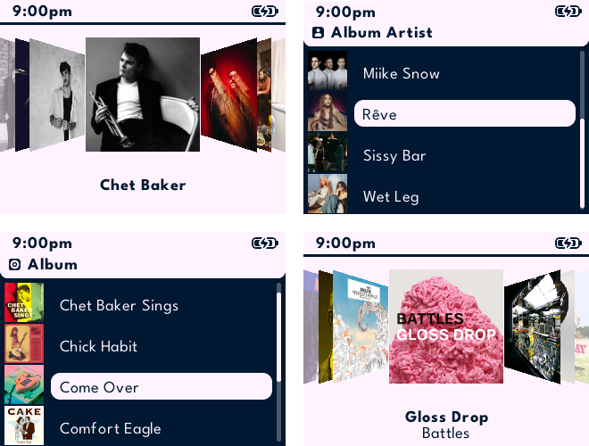
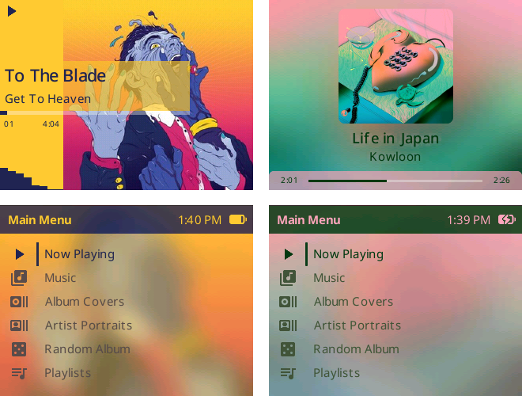
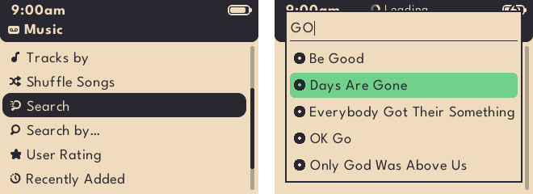
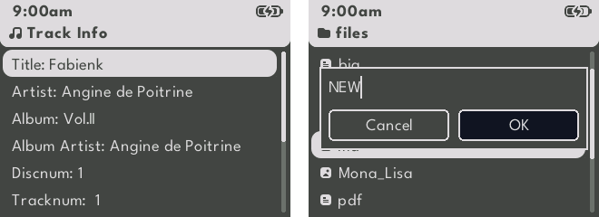
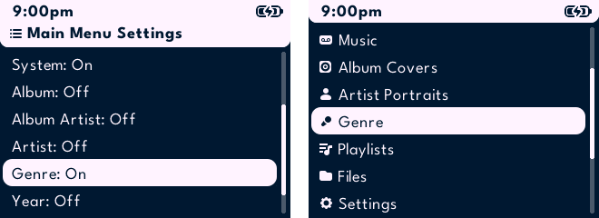

<p align="center">
  
</p>

# PodBox

PodBox is a modified version of Rockbox for the iPod Classic and iPod Video with a focus on simplifying
Rockbox whilst providing album and artist art everywhere with colour schemes that
follow the music.

> Please note that PodBox is still a work in progress and receiving regular updates until stable.

## Art everywhere



Album covers sit beside the rows in the album browser, and artist photos beside
artist rows. Two carousels are available from the main menu — **Album Covers**
and **Artist Portraits** — and you can go straight from a cover into that album,
or from an artist into their albums.

## Colours that follow the music



The interface re-colours itself from the current album art, throughout the user
interface.  There's also a mini spectrum visualiser for the now-playing screen.

## Instant search



You can now search across tracks, albums and artists with instant results.  Additionally,
the grid keyboard is gone, replaced by a single-line editor driven entirely by the click
wheel.

## Themed throughout



A modified version of the **Themify 2** theme ships as the default. Dialogs,
splashes and prompts have been standardised and improved, and screens that used to
break out of the theme no longer do.

## Your music library



The database menu is now called Music and its views can be promoted onto the main menu. You
can also turn items on and off inside the Music menu, order albums by year, and see
album and artist chart information (frequently played, recently played, forgotten).

## Documents, pictures and lyrics too


While the plugins have gone, the image viewer has been ported to the core system and
there's an improved text viewer that handles more file formats (including txt, lrc,
fb2, epub, docx, pdf, md, html and rtf).  There's also a new lyric viewer that can
be accessed from the "what's playing" screen by pressing select+play.

---

# Installation

## Does it run on my iPod?

| iPod | Generation | Years |
|---|---|---|
| **iPod Classic** | 6th / 7th gen | 2007–2014 |
| **iPod Video** | 5th / 5.5th gen | 2005–2006 |

Nothing else — not the Nano, Mini, Shuffle or Touch. If you have one of those,
you want [Rockbox](https://www.rockbox.org) itself, which supports 80+ players.

## Installing PodBox

Grab the zip for your player — `rockbox-ipod6g.zip` for the Classic,
`rockbox-ipodvideo-5g.zip` for the Video — and unzip it into the root of the
iPod's disk, so that the `.rockbox` folder sits alongside your music. That is
the whole update.

> **First time on this iPod?** A fresh player also needs the Rockbox bootloader
> installed once, which is a separate step and is not covered here — follow the
> [Rockbox installation guide](https://www.rockbox.org/manual.shtml) for your
> model first. If you are already running Rockbox or RockPod, unzipping is all
> you need.

# Setting up your music library

For best results, your music library should be set up in the following structure:

```text
Artist One
├── Album One
│   ├── 01 Track.flac
│   ├── 01 Track.lrc
│   ├── 02 Track.flac
│   ├── ...
│   └── folder.jpg
├── Album Two
│   └── ...
└── folder.jpg
Artist Two
└── Album One
    └── ...
Artist Three
└── Album One
    └── ...
```

## Album and artist art

To support the carousel and artwork in lists, your album art should be stored with the album
tracks as either folder.jpg or cover.jpg e.g. `Artist/Album/folder.jpg`.

Without these files, the art cache will only build from embedded images as tracks are played.

Your artist art should be stored with the album folders as either folder.jpg or cover.jpg
e.g. `Artist/folder.jpg`.

All artwork should be:

- stored as a baseline / non-progressive JPEG file
- stored at a "reasonable" resolution (the cache only stores them as 300x300px images) - anything
bigger than this will just take longer to process.

Artwork is processed quietly in the background while the database is idle, so browsing stays
fast.  As such, it can take a while to see the art appear.  You can check the cache activity by
checking `System > Background Tasks`.

A tool is available [here](tools/art_fetch/README.md) to fill your library with album and artist
artwork.

## Lyrics

To be able to access lyrics your lyrics should be:

- embedded in your audio files or stored with the album tracks with the same name as the track but
with a different extension e.g. `Artist/Album/01 Track.lrc`
- stored as either a .lrc, .lrc8 or .snc file

# Installing themes

To get the most out of PodBox you should use the modified [Themify 2](themes/Themify_2/README.md) theme
included as it supports all the new features built into PodBox and has received the most testing.

PodBox will support all Rockbox themes, however without modification they will **not** support dynamic
colours or art in lists.

> A selection of additional themes for PodBox are available [here](https://github.com/anthonyfletcher/podbox-themes/)

# User guides

- For guidance on using the new text input see [`text-input-guide.md`](docs/podbox/text-input-guide.md)
- For guidance on navigating the settings menu see [`settings-guide.md`](docs/podbox/settings-guide.md)

---

# Technical details

See [`technically-curious.md`](docs/podbox/technically-curious.md) for the history of PodBox and how to build
your own version.

Theme builders: See [`theme-guide.md`](docs/podbox/theme-guide.md) for guidance on creating
themes for PodBox.

## Credits

I'm not a C programmer, so this project has been developed with extensive AI assistance. The code itself is often AI-generated, but the ideas, feature design, specifications, testing, and iteration are mine.

This is a hobby project, built because I wanted a version of Rockbox that better suited how I use my iPod. I'm sharing it in the hope that others might find it useful too.

Built on the work of the [Rockbox](https://www.rockbox.org/) project, the
[RockPod](https://github.com/nuxcodes/rockpod) project and the [Themify 2](themes/Themify_2/README.md) theme.

## Licence

[GNU General Public License v2.0](https://www.gnu.org/licenses/old-licenses/gpl-2.0.html)

See [`docs/LICENSES`](docs/LICENSES) and [`docs/podbox/LICENSES`](docs/podbox/LICENSES).
