# PodBox

PodBox is a modified version of Rockbox for the iPod Classic and iPod Video with a focus on simplifying
Rockbox whilst providing album and artist art everywhere with colour schemes that
follow the music.

<a href='https://ko-fi.com/P3J3200FZY' target='_blank'></a>

# Key features

## Colours that follow the music

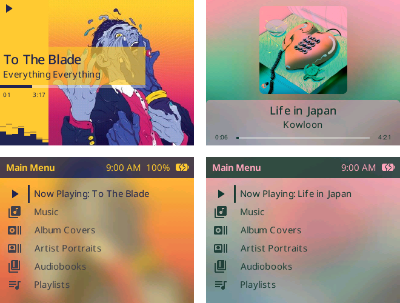

The interface re-colours itself from the current album art, throughout the user
interface.  PodBox ships with [Scrim](themes/scrim/README.md) - a new theme built around the enhanced theme
features including art filters, alpha blend boxes and spectrum visualization. There
are two variants with different playing screens.

## Art everywhere

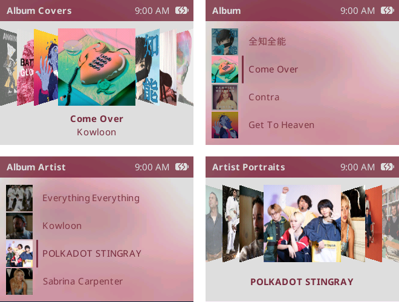

Album covers sit beside the rows in the album browser, and artist photos beside
artist rows. Two carousels are available from the main menu — **Album Covers**
and **Artist Portraits** — and you can go straight from a cover into that album,
or from an artist into their albums.

## Instant search

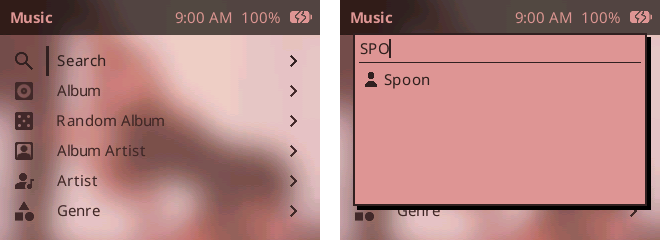

You can now search across tracks, albums and artists with instant results.  Additionally,
the grid keyboard is gone, replaced by a single-line editor driven entirely by the click
wheel.  Search is also available in settings to make finding things easier.

## Themed throughout

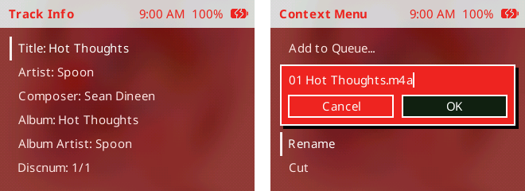

Dialogs, splashes and prompts have been standardised and improved, and screens that used to
break out of the theme no longer do.

## Your music library

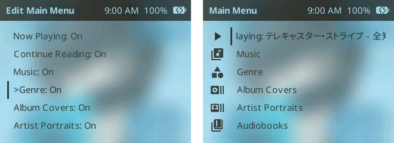

The database menu is now called Music and its views can be promoted onto the main menu. You
can also turn items on and off inside the Music menu, order albums by year or by artist, and see
album and artist chart information (frequently played, recently played, forgotten). You can
even break Audiobooks out into their own root menu (see below).

## Documents, pictures and lyrics too

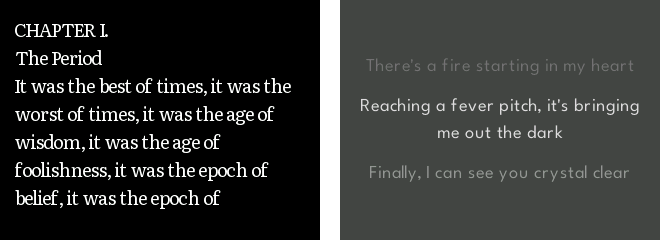

While the plugins have gone, the image viewer has been ported to the core system and
there's an improved text viewer that handles more file formats (including txt, lrc,
fb2, epub, docx, pdf, md, html and rtf).  There's also a new lyric viewer that can
be accessed from the "what's playing" screen by pressing `select+play`.

## Playback report

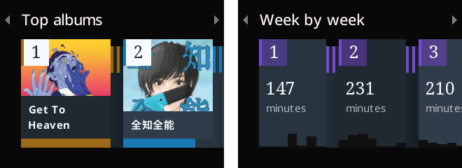

Derived from Spun (see [here](https://github.com/majorsiebe/Stats_for_iPod)), playback report reads your playback log (whether it's the
default logging or last.fm logging) and provides insights into your listening habits.

## Playlist engine

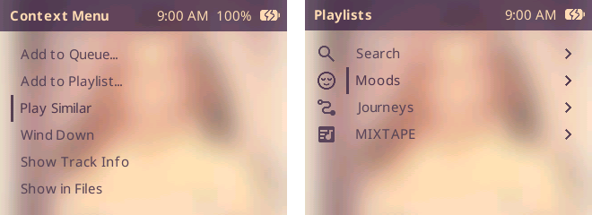

PodBox can analyse your library and measures how each track actually sounds --
its tempo, loudness, tonal balance, key and how busy it is -- then builds
a playlist of tracks that work together.  

## Games

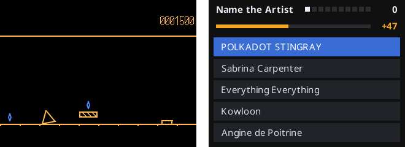

Play Spike while listening to your music. The game analyses each track's rhythm
and generates unique levels that move with the beat. Challenge yourself to set new
high scores as the difficulty ramps up over time.

Launch Spike from the context menu (hold <code>Select</code> then click
<code>Play with Spike</code>) on the Now Playing screen.  [Video](docs/podbox/videos/spike_game.mp4)

See how well you know your library - a clip plays from partway through a song and you
name the track, the artist, the album or the year from five options before the points
drain away.

Find it at the bottom of the Music menu (`Music > Quiz`).

---

# Installation

## Does it run on my iPod?

| iPod | Generation | Years |
|---|---|---|
| **iPod Classic** | 6th / 7th gen | 2007–2014 |
| **iPod Video** | 5th / 5.5th gen | 2005–2006 |

Nothing else — not the Nano, Mini, Shuffle or Touch. If you have one of those,
you want [Rockbox](https://www.rockbox.org) itself, which supports 80+ players.

## Installing PodBox

Grab the zip for your player [here](https://github.com/anthonyfletcher/podbox/releases) — `rockbox-ipod6g.zip` for the Classic,
`rockbox-ipodvideo-5g.zip` for the Video — and unzip it into the root of the
iPod's disk, so that the `.rockbox` folder sits alongside your music. That is
the whole update.

> **First time on this iPod?** A fresh player also needs the Rockbox bootloader
> installed once, which is a separate step and is not covered here — follow the
> [Rockbox installation guide](https://www.rockbox.org/manual.shtml) for your
> model first. If you are already running Rockbox or RockPod, unzipping is all
> you need.
>
> **Optional: the PodBox bootloader.** With it the player starts PodBox even
> when the hold switch is on, and holding Menu as it starts gives you Apple's
> firmware. Download `podbox-bootloader.zip` from the
> [Bootloader release](https://github.com/anthonyfletcher/podbox/releases/tag/Bootloader),
> unzip it on a Windows PC and follow its `README.txt`. It installs over the
> Rockbox bootloader.

# Setting up your music library

For best results, your music library should be set up in the following structure:

```text
Artist One
├── Album One
│   ├── 01 Track.flac
│   ├── 01 Track.lrc
│   ├── 02 Track.flac
│   ├── ...
│   └── folder.jpg
├── Album Two
│   └── ...
└── folder.jpg
Artist Two
└── Album One
    └── ...
Artist Three
└── Album One
    └── ...
```

## Album and artist art

To support the carousel and artwork in lists, your album art should be stored with the album
tracks as either folder.jpg or cover.jpg e.g. `Artist/Album/folder.jpg`, or embedded in the
tracks themselves. The image file is used first and the embedded cover when there is none;
`Settings > Library > Art Cache > Album Art Source` changes that order, or limits the cache to
one kind.

Your artist art should be stored with the album folders as either folder.jpg or cover.jpg
e.g. `Artist/folder.jpg`. Artist art only ever comes from image files. An artist folder with
no image of its own borrows one from the folder above it, so if your albums are grouped one
level deeper, as in `Artist/Albums/Album One`, artist art can stay in `Artist/folder.jpg`; an
image in the grouping folder (`Artist/Albums/folder.jpg`) takes precedence for the albums
under it. 

All artwork should be:

- stored as a JPEG file (baseline or progressive).
- embedded as JPEG, if embedded at all. PNG art in tags is skipped, and the cache reads one
track per album, so put the cover in every track.
- stored at a "reasonable" resolution - the cache stores 300x300px copies, and anything much
larger takes longer to process.

Artwork is processed quietly in the background while the database is idle, so browsing stays
fast.  As such, it can take a while to see the art appear.  You can check the cache activity by
checking `System > Background Tasks`. After adding art to your tags, run
`Settings > Library > Maintenance > Update Art Cache` to pick it up.

A tool is available [here](tools/art_fetch/README.md) to fill your library with album and artist
artwork.

## Lyrics

To be able to access lyrics your lyrics should be:

- embedded in your audio files or stored with the album tracks with the same name as the track but
with a different extension e.g. `Artist/Album/01 Track.lrc`
- stored as either a .lrc, .lrc8 or .snc file

## Playlist Engine

To use the playlist engine, you first need to analyse your library.  This is best done from a Windows
machine.  
- Run `soundscan.exe` from `.rockbox/tools/` whilst your iPod is attached to your PC.  This will analyse
 each track and store the findings in an index. 
- Turn on the playlist engine by going to `Settings > Library > Playlist Engine > Enabled`

# First run

When you first load PodBox it will be building your music and art database which will
affect performance initially (particularly on the 5G).  You can check progress of the
background tasks by going to `System > Background Tasks`.

The database can be built much faster from a Windows PC.  Once PodBox has started once, connect
the iPod and run `database_pb.exe` from `.rockbox/tools/`.  It does what
`Settings > Library > Maintenance > Update Database` does, keeping play counts, ratings and
positions; `database_pb.exe --rebuild` does what `Rebuild Database` does.  When it finishes,
eject the iPod; it restarts itself to load the new database.

The art cache can also be made on the PC: run `artcache_pb.exe` from `.rockbox/tools/`, after
`database_pb.exe` if you have added music.  It does what `Update Art Cache` does, and
`artcache_pb.exe --rebuild` what `Rebuild Art Cache` does.

# Installing themes

PodBox will support all Rockbox themes, however without modification they will **not** support dynamic
colours or art in lists.

To get the most out of PodBox you should use Scrim, the theme PodBox ships with.

Additional [themes](themes/README.md) designed for PodBox are a separate download, one zip each, or all of them 
in all-themes.zip, from the [Themes release](https://github.com/anthonyfletcher/podbox/releases/tag/Themes):

- [themify 2](themes/themify_2/README.md)
- [obsede 2](themes/obsede_2/README.md)
- [bony](themes/bony/README.md)
- [iclassic square](themes/iclassic_square/README.md) - classic, dark and light
- [jive](themes/jive/README.md)

**Make sure to update your themes whenever you update PodBox. Themes are rebuilt for each release, 
and a theme made for new firmware can fail on old firmware.**

All PodBox themes attempt to support as many languages as possible.

Unzip onto the root of the iPod, the same way you installed PodBox, then pick
it under `Settings > Appearance > Load Theme`. Each zip carries the fonts its theme needs, so
they can be installed in any order and on their own.

---

# Complete feature list

## Root menu

- Control the items displayed on the root menu and their order, promote items from the Music menu to the root menu.
  - `Settings > Appearance > Edit Main Menu`

## Music

- Album art displayed next to album rows
  - Theme dependent
  - See above for artwork setup
  - Control visibility via `Settings > Appearance > Interface Elements > Art Rows > Album Art Rows`
- Artist portrait displayed next to artist rows
  - Theme dependent
  - See above for artwork setup
  - Control visibility via `Settings > Appearance > Interface Elements > Art Rows > Artist Art Rows`
- Show the album release year before or after each album name
  - `Settings > Library > Music > Show Year in Album Lists`, off by default
- Control the sort order of the albums  chosen from name, year (oldest or newest first), 
  or artist then name or year
  - `Settings > Library > Music > Sort Albums By`
- Sort artists and albums ignoring a leading "The", "A" or "An"
  - Off by default.  Turn it on in `Settings > Library > Music > Sort Ignoring The/A/An`
- Sort artists by name or by most played
  - `Settings > Library > Music > Sort Artists By`
- Start playing a random album
  - `Music > Random Album`
- Search with live results across track, album or artist names
  - `Music > Search`
  - Control ordering of results via `Settings > Library > Music > Search`
  - See [`text-input-guide.md`](docs/podbox/text-input-guide.md) for guidance on inputting text
- See the most played albums/artists,  most recently played albums/artists and your forgotten album/artists
  - `Music > Playback History`
- Control the items displayed in the Music menu and their order
  - Change via `Settings > Library > Music > Edit Music Menu`
- Trim noise from track and album names (like featuring information)
  - Off by default.  Turn the feature on by going to `Settings > Library > Music > Trim Titles`
  - Add your own patterns in `.rockbox/library/user/trim.txt`, which an update leaves alone
- View listening progress against albums and artists
  - Hold `Select` on an Album or Artist and select `Listening Progress`
- Play the Music Quiz
  - Access by going to `Music > Quiz`
  - Choose which questions it asks in `Settings > Library > Music > Quiz Questions`
  - Turn it off in `Settings > Library > Music > Edit Music Menu`

## Featured Artists

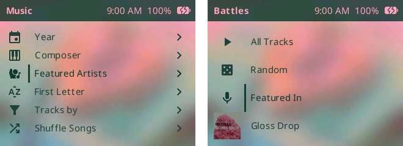

- See featured artists and their associated tracks - plus from an artist
  see the tracks they feature in
  - Off by default.  Turn the feature on by going to `Settings > Library > Music > Featured Artists`
  - `Music > Featured Artists` to access
  - See [`featured-artists-guide.md`](docs/podbox/featured-artists-guide.md) for more information

## Audiobooks

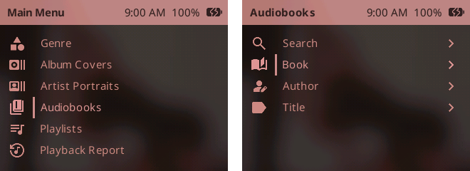

- Audiobooks can be segregated from Music into their own root menu and are excluded
from the Music menu and carousels
  - Off by default.  Turn the feature on by going to `Settings > Library > Music > Segregate Audiobooks`
  - Audiobooks should have a genre of "audiobook", "spoken word", "book", "podcast" or "podcasts".
- Audiobooks automatically receive a "resume" function - you don't need to bookmark
your position.
- Book covers and author photos next to their rows
  - Theme dependent
  - `Settings > Appearance > Interface Elements > Art Rows > Audiobook Art Rows`/`Author Art Rows`, off by default
- See which books you have finished, not started or are part-way through
  - Scroll up above the first book in `Audiobooks > Book` for `Finished`, `Not Started`
  and `In Progress`; a list with no books in it is not shown
  - Choosing a book plays it, from where you left off if you have started it
  - Hold `Select` on a book and select Mark as... to move it to In Progress, Not Started or 
  Finished. The mark lasts until the book is next played.
- Books held in a single file show their chapters.
  - Off by default.  Turn the feature on by going to `Settings > Playback > Chapter Marks`
  - Reads the chapter marks written into `.m4b` books and the chapter frames written
into `.mp3` ones
  - Also available while playing - hold `Select` on the Now Playing screen and choose
`Browse Chapters`

## Album Covers/Artist Portraits

- Simplified implementation which links to Music for tracks/albums
- Significantly improved performance (particularly on iPod video)
- Control whether opening an album lists the album tracks or starts playing the album
  - `Settings > Library > Carousel > On Album Select`
- Display the covers/portraits flat, face-on either side of the current one
  - `Settings > Appearance > Carousel > View Mode`
- Sort the covers/portraits independently of Music, or the same way
  - `Settings > Library > Carousel > Sort Same as Music`, off by default
- Give the carousel a fixed background colour that dynamic colours leave alone
  - `Settings > Appearance > Carousel > Background > Custom`
- Spin to a random album or artist
  - Hold `Play`
  - `Settings > Library > Carousel > Random Spin Length` to control how far it spins

## What's playing

- View lyrics for currently playing music
  - Press `Select + Play` (the hotkey's default; reassign it under `Settings > Playback > Now Playing Screen`)
- Control how lyrics are displayed
  - `Settings > Library > Viewers > Lyrics Viewer`
- Show either album art or artist art in the now playing screen
  - Theme dependent (must currently show album art)
  - `Settings > Appearance > Now Playing Screen > Now Playing Artwork`
  - In auto mode the art will be shown depending on how you arrived at playing the track. If
you opened `Music > Artist > Album > Track` the artist art would show - if you opened `Music >
 Album > Track` the album art would show.
- Start a sleep timer from the Now Playing screen, with your usual length preselected
  - Hold `Select` and select `Sleep Timer`

## Playlist engine

- Create a playlist of tracks similar to one you like by holding `Select` on the
  track and selecting `Play Similar` from the context menu.
  - Also on an album or a folder, which builds the playlist around the album as a whole
- Play tracks based on Moods -- Calm, Energetic, Dark, Warm, Punchy, Hypnotic and  
  ten more are available by going to `Playlists > Moods`
- Play tracks that take you from one mood to another by going to `Playlists > Journeys`.
- Wind down from a track you choose, with each track calmer than the last
  - Hold `Select` on the track and select `Wind Down`.  It asks how long to run, Default 
  or 15 minutes to two hours. Default fills to a running sleep timer, or else to Playlist Length.
- Put a playlist in an order where each track leads into the next
  - Hold `Select` in the playlist viewer and select `Order by Sound`
- See what a track sounds like, in words -- its moods, energy, pace, tone, key and more
  - Hold `Select` on the track, select `Show Track Info` and open the `Sound` row
- See what an album or folder sounds like as a whole
  - Hold `Select` on the album or folder and select `Album Sound`
- See what the analysis found across your whole library, and how much of it is measured
  - `Settings > Library > Playlist Engine > Library Sound`
  - Overview, Moods, Pace, Keys and Loudness by Decade show how many tracks each mood can draw on, 
  plus the spread of tempos and keys.
- Choose whether Play Similar and Wind Down start with the track you chose
  - `Settings > Library > Playlist Engine > Play Selected First`
- Turn on the Continue Playing setting to keep the music going when any playlist runs 
  out -- an album, a saved playlist, or a dynamic one -- by extending it with more of the
  same.  Turn it on by going to `Settings > Library > Playlist Engine > Continue Playing`.
- Turn on the playlist engine by going to `Settings > Library > Playlist Engine > Enabled`, 
  which starts the analysis. It takes a while on the player, so a Windows tool that does the same
  job much faster ships inside the firmware at `.rockbox/tools/` called `soundscan.exe`.
- Read more [here](docs/podbox/playlist-engine.md).

## Playback report

- A scrolling row of cards built from your log -  In numbers, Week by week, Top artists, Top songs, Top albums,
Skips and Achievements - plus Newly unlocked, when you have earned something
since you last looked
  - The wheel scrolls along a section, `Left`/`Right` change section
  - `Select` opens a card and folds the detail out behind it - the figures, who a
song is by, the album it came from
  - `Play` on an artist, album or song card plays it
  - Hold `Menu` for the year picker and the settings.  The report covers one
  calendar year at a time, or all time

## Files/Documents/Images

- Re-engineered text engine compatible with more formats
- Control how documents are displayed (font, margin, line spacing, colours)
  - `Settings > Library > Viewers > Text Viewer`
- See a list of all documents and images stored on the device
  - Hidden by default - enable via `Settings > Appearance > Edit Main Menu`
- Continue reading added to the root menu to continue from where you left off
- Search across all files

## Appearance

- Dynamic colouring of the UI based on the album/artist art including transformation of all theme 
colours
  - Theme dependent
  - `Settings > Appearance > Interface Colours > Dynamic Colors`
- Choose whether the album's lighter or darker colour becomes the background
  - `Settings > Appearance > Interface Colours > Dynamic Colors Background`
- Control whether scrolling is enabled across the UI or whether long text is cut short with "..." 
instead. 
  - `Settings > Appearance > Scrolling > Enabled`, on by default
- Edits to appearance settings save to a config file linked to the running theme, so when you revert 
themes your settings follow, and themes don't inherit settings they don't set
  - `Settings > Appearance`
  - To reset to default
  - `Settings > Appearance > Forget My Changes`
- Art filters available to modify art in the carousel
  - `Settings > Appearance > Carousel > Artwork Filter`

## Language

- Override language strings with your own to customise your experience
  - See [`language-override-guide.md`](docs/podbox/language-override-guide.md)

## Settings

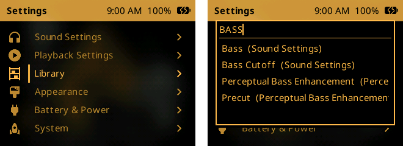

- Settings reworked
  - See [`settings-guide.md`](docs/podbox/settings-guide.md)
- Search settings by keyword
  - Settings > Search (scroll up)
  - See [`text-input-guide.md`](docs/podbox/text-input-guide.md) for guidance on inputting text
- Settings organised into "Standard" and "Everything" to filter out settings not commonly edited
  - `Settings > Settings Mode`
- See all changed settings in a single view
  - `Settings > Changed Settings`
- View a description of each setting from the setting menu
  - Hold `Select` to open the context menu then select `Explain`
- Shut down or reboot from the menu
  - `Settings > System > Startup/Shutdown`

## Behind the scenes

- Improved consistency of the `Back` and `Menu` button in menus
- Art for use in the UI is cached for quick access to enable a fluid experience
  - `Settings > Library > Art Cache` for settings
  - `Settings > Library > Maintenance > Update Art Cache`/`Rebuild Art Cache` for tasks
  - `System > Background Tasks` for monitoring
- Your library data - database, play history and caches - now lives in `.rockbox/library/`
- Information about albums, artists and play counts now centralised in a database summary index
  - `Settings > Library > Maintenance > Update Index` for tasks
  - `System > Background Tasks` for monitoring
- Dialogs reworked to provide consistent and "themed" message, input, confirmation, search, colour, date/time and folder select boxes
  - `Settings > Appearance > Dialogs` for settings
- Additional theme tags to provide richer graphics and support easier theme development
  - See [`custom-skin-tags.md`](docs/podbox/custom-skin-tags.md)

## Connectivity

All connectivity described below works on both the iPod video and the iPod classic, apart from the
earphone remote (see Headphones) - however testing has only been completed on a small number of
accessories.  If you'd like to support testing, please follow [this guide](docs/podbox/connectivity-testing-guide.md).

The USB and accessory settings below are under `Settings > System`, and some are shown only with
`Settings > Settings Mode` set to `Everything`.

### Sound card (New)


Your iPod can act like a sound card - the computer plays through the iPod, out of its headphone socket, 
using the iPod DAC.
- Tested on Windows, MacOS and Ubuntu
- `Settings > System > USB > USB Sound Card` - off by default; turning it on can need a restart

### USB Host (New)


Your iPod can output to a USB DAC - the iPod sends its audio digitally over USB to a
headphone amp or DAC, which does the conversion instead of the iPod.
- `Settings > System > USB > USB DAC Output > Start Automatically` - on by default - or `Turn On`
  for a DAC with its own power supply that doesn't power the iPod
- The iPod supplies no power over USB, so the DAC needs its own supply - or you can use a
  USB splitter with a charger connected
- Most USB audio DACs should work; ones that only offer rates other than 44.1 and 48 
  kHz will not, and neither will a DAC behind a hub

### Docks and receivers (Improved)


Your iPod can output digital audio out to a dock - a dock that takes the iPod's audio
digitally, over the USB pins of the dock connector
- On by default, through `Settings > System > Accessories > Accessory Protocol`
- Needs `Settings > System > USB > USB Mode` set to `Mass Storage` - in `Charge Only` the iPod
  doesn't talk to docks or cars over USB
- Remote support improved to match click-wheel actions

A receiver or dock that browses an iPod shows what is playing and can browse 
and play your library from its own screen and remote
- Artist, album and title of the playing track
- Playlists, Artists, Albums, Genres, Composers and Songs, as far as the
  accessory offers them, sorted the way the Music menu sorts them
- `Settings > System > Accessories > Accessory Browsing` sets how many songs a list can hold -
  10,000 by default.

Your iPod can mirror its screen on a TV - through a dock with a video output
- `Settings > System > Accessories > TV Out > Turn On` - always off after a restart
- `Size` - `1x` (sharp, in the middle of the TV) or `2x` (fills most of it)
- `Standard` - PAL or NTSC, iPod Video only
- On an iPod Video the iPod's own screen goes black while it's on

### Modern Cars (New/Experimental)


A car that takes an iPhone over USB, but no longer an iPod, can now connect to your iPod. The iPod
speaks iAP2, the protocol an iPhone uses, and the car plays it as a USB media source - not CarPlay.
- Plays through the car's speakers, with the car's own buttons and steering-wheel controls for
  play, pause, skip, shuffle and repeat.
- Title, artist, album, cover art and a moving progress bar on the car's screen
- Your whole library in the car's own browser - pick an artist, album, playlist or song there and the iPod
  plays it
- `Settings > System > Accessories > iPhone Accessories` - `Auto` by default. Auto recognises a car,
  and a computer still mounts the iPod as a disk, about a second later than it otherwise would.
  Shown only while `Accessory Protocol` is on
- `Settings > System > Accessories > Car Artwork` specifies where the cover comes from.
  `Prefer Cache` by default, which appears almost at once. `Prefer Embedded` and `Prefer Image File`
  send the original image - sharper, but slower to appear and more work for a 5G. Only JPEGs under 512 KB are sent
  as they are
  
### Headphones (Improved)


You can control your iPod using the earphone remote (supported on the iPod classic
120GB - Late 2008 and 160GB - Late 2009 thin versions only)
- Works on all types of headphones - not just the Apple earpods.
- Click for play/pause, two clicks for the next track, three for the previous
  one, and the volume buttons
- Always on. The multi-click skips are `Settings > System > Accessories > Remote Track Skip`, on
  by default; turning it off makes play/pause react quicker

---

# Technical details

See [`technically-curious.md`](docs/podbox/technically-curious.md) for the history of PodBox and how to build
your own version.

Theme builders: See [`theme-guide.md`](docs/podbox/theme-guide.md) for guidance on creating
themes for PodBox.

## Licence

RockBox, RockPod and additions by PodBox are licensed under the [GNU General Public License v2.0](https://www.gnu.org/licenses/old-licenses/gpl-2.0.html).

Imported code governed by a previous licence is listed in
[`docs/LICENSES`](docs/LICENSES); the fonts and themes this fork adds are
credited below, each with a link to its full licence text.

## Development credits

This project has been developed with extensive AI assistance. I am a software developer, 
although C is not my primary language. I have driven the project's architecture, feature 
design, specifications, implementation approach, testing, debugging, and iteration. AI 
has been used as a development tool to assist with the C implementation, generate and 
explore solutions, and accelerate development. The resulting code is reviewed, tested, 
and iterated by me rather than being accepted as unreviewed generated output.

This is a hobby project, built because I wanted a version of Rockbox that better suited 
how I use my iPod. I'm sharing it in the hope that others might find it useful too.

Built on the work of:
- the [Rockbox](https://www.rockbox.org/) project
- the [RockPod](https://github.com/nuxcodes/rockpod) project (Nux Li: aka [@nuxcodes](https://github.com/nuxcodes))
- the [Spun](https://github.com/majorsiebe/Stats_for_iPod) project (Siebe Majoor: aka [@majorsiebe](https://github.com/majorsiebe))

## Other credits

### Themes

- Themify 2
  - Created by: Evan Kenny aka [Dook](https://d00k.net/)
  - License: CC BY-SA 3.0 (https://creativecommons.org/licenses/by-sa/3.0/deed.en)
- Obsede' 2
  - Created by: Serge Fahnenstell
  - License: CC BY-SA 3.0 (https://creativecommons.org/licenses/by-sa/3.0/deed.en)
- Bony
  - Based on BONES created by: Chuck Lardo
  - License: CC BY-SA 4.0 (https://creativecommons.org/licenses/by-sa/4.0/deed.en)
- iClassic Square (and its Dark and Light versions)
  - Created by: Humberto Santana
  - License: CC BY-SA 3.0 (https://creativecommons.org/licenses/by-sa/3.0/deed.en)
- Jive
  - Created by: James Stevenson
  - License: CC BY-SA 3.0 (https://creativecommons.org/licenses/by-sa/3.0/deed.en)

### Fonts

Each theme carries the full licence text of the fonts it ships, beside them in
its own `.rockbox/fonts/`. The links below point at one copy of each.

- Material Design Icons
  - Created by Google (https://fonts.google.com/icons)
  - Licensed under the Apache License Version 2.0 —
    [full text](themes/scrim/.rockbox/fonts/LICENSE-Material-Design-Icons.txt)
- Noto Sans/Serif Font
  - Copyright 2022 The Noto Project Authors (https://github.com/notofonts/latin-greek-cyrillic)
  - Noto Sans built from MicroNotoSans - a fork of Noto Sans by Evan Kenny aka [Dook](https://d00k.net/)
  - Copyright 2026 Micro Noto Sans Authors (https://github.com/D0-0K/MicroNotoSans)
  - Licensed under the SIL Open Font License, Version 1.1 —
    [full text](themes/scrim/.rockbox/fonts/LICENSE-Noto.txt)
- Seven Fifteen Font
  - Copyright Douglas Vautour (https://burpyfresh.itch.io/seven-fifteen-font)
  - Bundled together with UnifontEX, a fork of GNU Unifont maintained by stgiga
    (https://github.com/stgiga/UnifontEX), which draws the scripts Seven Fifteen
    does not cover
  - Seven Fifteen licensed under CC BY-SA 4.0; UnifontEX under the GNU General
    Public License version 2 or later with the GNU font embedding exception, or
    the SIL Open Font License version 1.1 —
    [full text](themes/scrim/.rockbox/fonts/LICENSE-Seven-Fifteen.txt)
- League Spartan Font
  - Copyright 2020 The League Spartan Project Authors (https://github.com/theleagueof/league-spartan)
  - Copyright 2022 The Noto Project Authors (https://github.com/notofonts/devanagari)
  - Copyright 2026 Micro Noto Sans Authors (https://github.com/D0-0K/MicroNotoSans)
  - Licensed under the SIL Open Font License, Version 1.1 —
    [full text](themes/themify_2/.rockbox/fonts/LICENSE-LeagueSpartan.txt)
- ProFont Font
  - Copyright 2014 Andrew Welch, Carl R. Osterwald, Stephen C. Gilardi
  - Licensed under the MIT License —
    [full text](themes/bony/.rockbox/fonts/LICENSE-ProFont.txt)

### Modern cars (iAP2)

Thank you to the following sources, which supplied facts about the protocol - message numbers,
layouts and behaviour to support the iAP2 development. Which fact came from where is in
[`iap2-sources.md`](docs/podbox/iap2-sources.md).

- carplayd by lvalen91 (https://github.com/lvalen91/carplayd)
  - The message table and the order of authentication and identification
- Nocturne by the Nocturne team (https://github.com/usenocturne/nocturne)
  - Now playing, the car's buttons and file transfers
- carplay-wifi-extractor by HaToan (https://github.com/HaToan/carplay-wifi-extractor)
  - The phone's side of the conversation
- JJTech0130's iAP2 gists (`carkit_iap2.py`, the `iap2.lua` Wireshark dissector)
  - The message names, and how to talk iAP2 to a real iPhone
- Adam Bell, "McLarens and CarPlay" (https://blog.adambell.ca)
  - Showed that a device can stand in for an iPhone in a car
- usbmuxd from libimobiledevice (https://github.com/libimobiledevice/usbmuxd)
  - Apple's USB mode requests
- pymobiledevice3 by doronz88 (https://github.com/doronz88/pymobiledevice3)
  - Fetched the iPhone's logs of its conversation with the car

### Spike Video

- Song: Gabriawll - Recall
- Music provided by NoCopyrightSounds
- Free Download/Stream: http://ncs.io/Recall
- Watch: http://ncs.lnk.to/RecallAT/youtube

### Album Artwork

- Angine de Poitrine - Vol.II - [Website](https://anginedepoitrine.com/)
  - Artwork: Arielle Corbeau - [Website](https://www.instagram.com/ariellecorbeau)
- Battles - Glass Drop - [Website](https://battles.warp.net/)
  - Artwork: Lesley Unruh - [Website](http://www.unruhphoto.com)
- Everything Everything - Get To Heaven - [Website](https://everything-everything.co.uk/)
  - Artwork: Andrew Archer - [Website](https://www.andrewarcher.com)
- Kowloon - Come Over - [Website](https://www.kowloonkowloon.com/)
  - Artwork: Ram Han - [Website](https://www.instagram.com/ram__han/)
- POLKADOT STINGRAY - 全知全能 - [Website](https://polkadot-stingray.jp/)
  - Artwork: Shizuku (雫) - [Website](https://www.instagram.com/plkshizuku/)
- Sabrina Carpenter - Man's Best Friend - [Website](https://www.sabrinacarpenter.com/)
  - Artwork: Bryce Anderson - [Website](https://www.instagram.com/brvceanderson)
- Spoon - Hot Thoughts - [Website](http://spoontheband.com/)
  - Artwork: Christine Messersmith
- Vampire Weekend - Contra - [Website](http://vampireweekend.com/)
  - Artwork: Complicated  