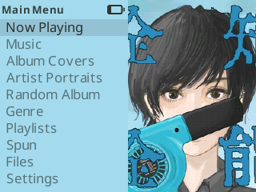
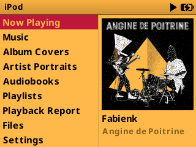
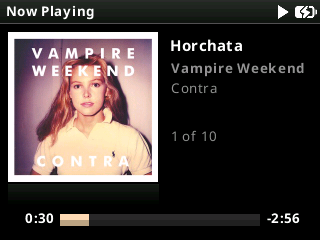
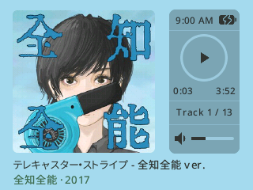

# Additional themes

These themes have been modified to support features of PodBox. They are not in
the build: each is a zip of its own on the
[Themes release](https://github.com/anthonyfletcher/podbox/releases/tag/Themes),
carrying the fonts it needs. Scrim, the theme PodBox starts with, ships with the
firmware instead.

## themify_2

[Click for more information](themify_2/README.md)

## obsede_2

[Click for more information](obsede_2/README.md)

## bony

[Click for more information](bony/README.md)

## iclassic_square

[Click for more information](iclassic_square/README.md)

## iclassic_square_dark

[Click for more information](iclassic_square_dark/README.md)

## jive

[Click for more information](jive/README.md)