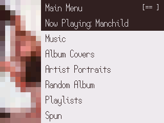
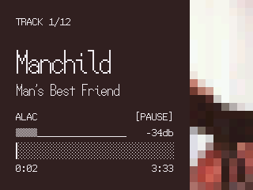
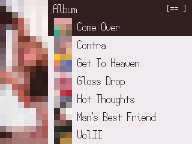
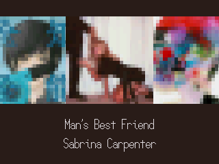

# Bony

## Details
- Created by: Anthony Fletcher
- Based on BONES
- BONES created by: Chuck Lardo
- License: CC BY-SA 4.0 (https://creativecommons.org/licenses/by-sa/4.0/deed.en)

## Seven Fifteen Font
- The `24-seven-fifteen` and `48-seven-fifteen` files bundled here are built from
Seven Fifteen and UnifontEX together. Seven Fifteen draws the Latin, Greek,
Cyrillic, Hebrew, Thai, Georgian, Devanagari, kana and Hangul; UnifontEX draws
the Han ideographs and the other scripts Seven Fifteen does not cover.
- Seven Fifteen Font Copyright Douglas Vautour (https://burpyfresh.itch.io/seven-fifteen-font)
- Licensed under CC BY-SA 4.0 (https://creativecommons.org/licenses/by-sa/4.0/deed.en)
- UnifontEX Font Copyright (c) 1998-2023 Roman Czyborra, Paul Hardy, Qianqian Fang,
  Andrew Miller, Johnnie Weaver, David Corbett, Nils Moskopp,
  Rebecca Bettencourt, Minseo Lee, stgiga, et al.
- A fork of GNU Unifont, maintained by stgiga (https://github.com/stgiga/UnifontEX)
- Dual-licensed under the GNU General Public License version 2 or later with
  the GNU font embedding exception (https://www.gnu.org/licenses/gpl-2.0.html),
  and the SIL Open Font License version 1.1
  (https://openfontlicense.org/open-font-license-official-text/)
- Full text: `/.rockbox/fonts/LICENSE-Seven-Fifteen.txt`

## ProFont Font
- Copyright 2014 Andrew Welch, Carl R. Osterwald, Stephen C. Gilardi
- This Font Software is licensed under the MIT License (https://opensource.org/license/mit).
- Full text: `/.rockbox/fonts/LICENSE-ProFont.txt`

## Screenshots

## Installation

Download the ZIP file from the release page [here](https://github.com/anthonyfletcher/podbox/releases/tag/Themes).

Unzip and copy the .rockbox folder to the root of your iPod drive.

Select `Settings > Appearance > Load Theme` and then `bony` from the list
