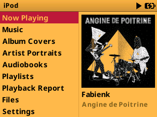
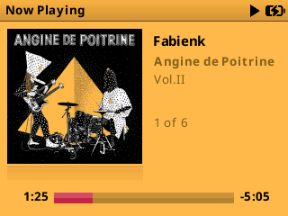
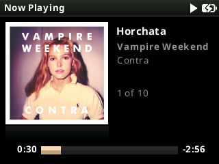
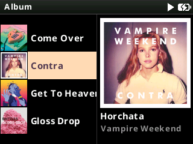
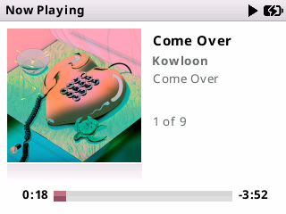
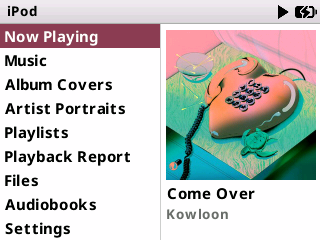

# iClassic Square

## Details

- Original theme: https://themes.rockbox.org/index.php?themeid=1311&target=ipod6g
- Created by: Humberto Santana
- License: CC BY-SA 3.0 (https://creativecommons.org/licenses/by-sa/3.0/deed.en)

Modified to support dynamic colours and album/artist art.

Three versions come in the one zip:

- `iclassic_square` - the original look.
- `iclassic_square_dark` - white and grey on black.
- `iclassic_square_light` - black and grey on white.

In Dark and Light the progress bar, the volume bar and the selected row take
their colour from the album playing; the preferences below choose which parts
do.

## Material Design Icons
- Created by Google (https://fonts.google.com/icons)
- Licensed under the Apache License Version 2.0 (https://www.apache.org/licenses/LICENSE-2.0).
- Full text: `/.rockbox/fonts/LICENSE-Material-Design-Icons.txt`

## Noto Sans Font
- Copyright 2022 The Noto Project Authors (https://github.com/notofonts/latin-greek-cyrillic)
- This Font Software is licensed under the SIL Open Font License, Version 1.1 (https://openfontlicense.org/).
- Built from MicroNotoSans - a fork of Noto Sans by Evan Kenny aka [Dook](https://d00k.net/)
- Copyright 2026 Micro Noto Sans Authors (https://github.com/D0-0K/MicroNotoSans)
- Full text: `/.rockbox/fonts/LICENSE-Noto.txt`

## Screenshots

### Dark:

### Light:

## Preferences (Dark and Light)

Edit `/.rockbox/themes/iclassic_square_dark.preferences` or
`iclassic_square_light.preferences` on the player, then load the theme again to
pick the change up. `yes` gives a part the album's colour and `no` keeps it
white in Dark, black in Light.

| Preference | Values | Default | What it colours |
|---|---|---|---|
| `vivid_progress_bar` | `yes`, `no` | `yes` | The progress bar on the playing screen. |
| `vivid_volume_icons` | `yes`, `no` | `yes` | The speaker icons either side of the volume bar. |
| `vivid_volume_bar` | `yes`, `no` | `yes` | The volume bar, shown in place of the progress bar while the volume changes. |
| `vivid_transport_icon` | `yes`, `no` | `no` | The play, pause, fast-forward, rewind and hold icon in the title bar. |
| `vivid_battery_icon` | `yes`, `no` | `no` | The battery icon in the title bar. |
| `vivid_title_bar` | `yes`, `no` | `no` | The bar along the top of the screen. `no` keeps it grey. |
| `vivid_title_text` | `yes`, `no` | `no` | The title bar's text: the list's name, or Now Playing. |
| `vivid_song_text` | `yes`, `no` | `no` | The song's title, on the playing screen and in the pane beside lists. |
| `vivid_selection` | `yes`, `no` | `yes` | The bar behind the selected row. |

## Installation

Download the ZIP file from the release page [here](https://github.com/anthonyfletcher/podbox/releases/tag/Themes).

Unzip and copy the .rockbox folder to the root of your iPod drive.

Select `Settings > Appearance > Load Theme` and then `iclassic_square`,
`iclassic_square_dark` or `iclassic_square_light` from the list
