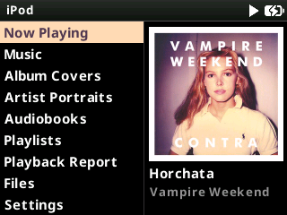
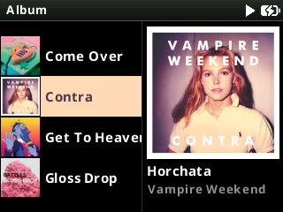

# iClassic Square Dark

## Details

- Original theme: https://themes.rockbox.org/index.php?themeid=1311&target=ipod6g
- Created by: Humberto Santana
- License: CC BY-SA 3.0 (https://creativecommons.org/licenses/by-sa/3.0/deed.en)

A dark version of iClassic Square: white and grey on black. The progress bar,
the volume bar and the selected row take their colour from the album playing.

Modified to support dynamic colours and album/artist art.

## Material Design Icons
- Created by Google (https://fonts.google.com/icons)
- Licensed under the Apache License Version 2.0 (https://www.apache.org/licenses/LICENSE-2.0).
- Full text: `/.rockbox/fonts/LICENSE-Material-Design-Icons.txt`

## Noto Sans Font
- Copyright 2022 The Noto Project Authors (https://github.com/notofonts/latin-greek-cyrillic)
- This Font Software is licensed under the SIL Open Font License, Version 1.1 (https://openfontlicense.org/).
- Built from MicroNotoSans - a fork of Noto Sans by Evan Kenny aka [Dook](https://d00k.net/)
- Copyright 2026 Micro Noto Sans Authors (https://github.com/D0-0K/MicroNotoSans)
- Full text: `/.rockbox/fonts/LICENSE-Noto.txt`

## Screenshots

## Installation

Download the ZIP file from the release page [here](https://github.com/anthonyfletcher/podbox/releases/tag/Themes).

Unzip and copy the .rockbox folder to the root of your iPod drive.

Select `Settings > Appearance > Load Theme` and then `iclassic_square_dark` from the list
