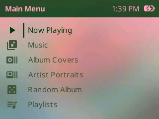
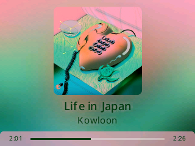
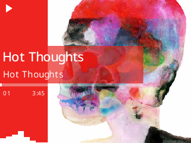

# Scrim and Scrim_p

## Details
- Original theme for PodBox.
- Created by: Anthony Fletcher
- License: CC BY-SA 3.0 (https://creativecommons.org/licenses/by-sa/3.0/deed.en)

## Fonts

Scrim ships with the firmware, so its fonts land in `/.rockbox/fonts/` on the
player, each with its full licence text beside it.

- Material Design Icons (`24x24-icons`)
  - Created by Google (https://fonts.google.com/icons)
  - Apache License Version 2.0 — `LICENSE-Material-Design-Icons.txt`
- Noto Sans and Noto Serif (`12`/`18`/`22`/`26-noto-sans*`, `22-noto-serif`)
  - Copyright 2022 The Noto Project Authors (https://github.com/notofonts/latin-greek-cyrillic)
  - Noto Sans built from MicroNotoSans - a fork of Noto Sans by Evan Kenny aka [Dook](https://d00k.net/)
  - Copyright 2026 Micro Noto Sans Authors (https://github.com/D0-0K/MicroNotoSans)
  - SIL Open Font License, Version 1.1 — `LICENSE-Noto.txt`
- Seven Fifteen (`24-seven-fifteen`)
  - Copyright Douglas Vautour (https://burpyfresh.itch.io/seven-fifteen-font)
  - Bundled with UnifontEX, a fork of GNU Unifont maintained by stgiga
    (https://github.com/stgiga/UnifontEX), which draws the scripts Seven
    Fifteen does not cover
  - CC BY-SA 4.0; UnifontEX under the GPL v2 or later with the GNU font
    embedding exception, or the SIL Open Font License 1.1 —
    `LICENSE-Seven-Fifteen.txt`

## Screenshots

## Installation

Scrim is shipped with PodBox.  Switch between `scrim` and `scrim_p` via `Settings > Appearance > Load Theme`.

## Preferences

Edit `/.rockbox/themes/scrim.preferences` on the player, then load the theme
again to pick the change up.

| Preference | Values | Default | What it does |
|---|---|---|---|
| `sub-line mode` | `artist`, `album`, `artist-album`, `album-artist`, `playlist_name` | `artist` | What the line under the track title shows. Both `scrim` and `scrim_p`. |
| `auto-hide` | `off`, `5`, `10`, `30` | `off` | Seconds without a button press or wheel turn before the track title, sub-line, progress bar, times and status icons clear away. Any input brings them back. `scrim` only. |
| `play-pause icon` | `current`, `next` | `current` | `current` shows what is happening; `next` shows what pressing Play will do -- pause while a track plays. `scrim` only: `scrim_p` fades the cover and draws pause bars over it instead. |
| `spectrum peaks` | `on`, `off` | `on` | Falling peak caps on the spectrum analyser. `scrim` only. |
