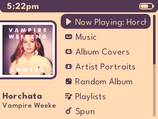
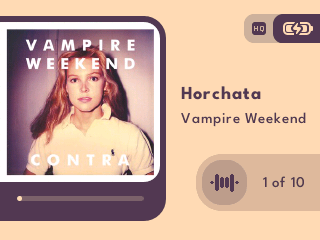
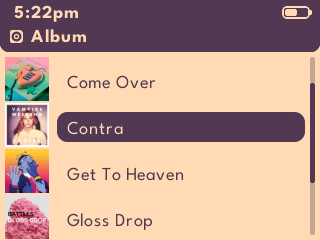
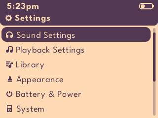

# Themify 2

## Details
- Original theme: https://themify.d00k.net
- Source code: https://git.sr.ht/~dook/Themify
- Created by: Evan Kenny aka [Dook](https://d00k.net/)
- License: CC BY-SA 3.0 (https://creativecommons.org/licenses/by-sa/3.0/deed.en)

Modified to support dynamic colours and album/artist art.  Icons added for new functionality.

## League Spartan Font
- Copyright 2020 The League Spartan Project Authors (https://github.com/theleagueof/league-spartan)
- Copyright 2022 The Noto Project Authors (https://github.com/notofonts/devanagari)
- Copyright 2026 Micro Noto Sans Authors (https://github.com/D0-0K/MicroNotoSans)
- License: SIL Open Font License, Version 1.1 (https://openfontlicense.org/).

## Screenshots

## Installation

Download the ZIP file from the release page [here](https://github.com/anthonyfletcher/podbox/releases/tag/Themes).

Unzip and copy the .rockbox folder to the root of your iPod drive.

Select `Settings > Appearance > Load Theme` and then `themify_2` from the list
